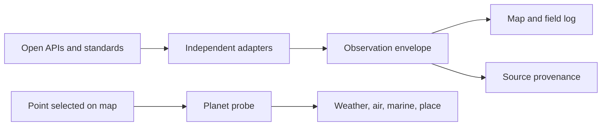

# Planetary Signals

**An open-data observatory for the planet's changing conditions.**

[Open the live interface](https://planetary-signals.rajat-nagrat-4946.chatgpt.site)

Planetary Signals turns fragmented public data into one explorable field: earthquakes, natural hazards, weather alerts, biodiversity, marine observations, humanitarian events, solar activity, research and Internet infrastructure. It does not collapse the planet into a single health score. It preserves source, time, uncertainty, licence and quality so unlike signals stay legible.

## What is working

- Interactive global map with clustering, eight switchable signal layers and a chronological field log.
- Sixteen no-key server-side live adapters with independent timeouts and health states.
- Credential-ready OpenAQ, eBird and OpenTopography adapters that report `unconfigured` until their server-side keys are supplied.
- Click-anywhere planet probe combining local weather, air quality, marine conditions and reverse geocoding.
- Searchable source atlas covering 51 public planetary data systems across eight domains.
- Source-level provenance, original-record links, freshness badges and verified/reported/modeled quality.
- Responsive desktop and mobile layouts, keyboard focus states and reduced-motion support.
- Honest partial and sample modes: sample records are labeled and never silently mixed in as live measurements.

## Connected open services

| Interface | Provider | Signal |
| --- | --- | --- |
| USGS GeoJSON feed | USGS | Earthquakes from the last 24 hours |
| EONET API v3 | NASA | Open fires, storms, volcanoes, floods and other natural events |
| Active Alerts API | NOAA / NWS | Official weather warnings and geometries |
| Occurrence API | GBIF | Geolocated terrestrial biodiversity observations |
| Observations API | iNaturalist | Recent research-grade citizen observations |
| Occurrence API | OBIS | Marine biodiversity records |
| Latest observations | NOAA NDBC | Buoy wind, waves, pressure and temperature |
| Water Data OGC API | USGS | Recent continuous river-discharge observations |
| GOES X-ray JSON | NOAA SWPC | Near-live solar X-ray flux |
| DONKI web service | NASA CCMC | Recent solar flares and active regions |
| Close Approach API | NASA JPL CNEOS | Predicted near-Earth object approaches |
| Disasters API | UN OCHA ReliefWeb | Curated humanitarian disaster records |
| Common Metadata Repository | NASA Earthdata | Recently updated Earth science collections |
| Works API | OpenAlex | Recent planetary and climate research |
| Indicators API | World Bank | Global development context |
| Measurements API | RIPE Atlas | Active Internet measurement count |
| Forecast API | Open-Meteo | Point weather and daylight context |
| Air Quality API | Open-Meteo | AQI, particles and atmospheric chemistry |
| Marine API | Open-Meteo | Wave and sea-surface conditions |
| Reverse API | OpenStreetMap Nominatim | Human-readable location context |
| Raster tiles | OpenStreetMap + CARTO | Map context and place labels |

The Source Atlas additionally records high-value systems that require a key, registration, a domain-specific client or a heavier raster pipeline. `connected` means the current application calls it; `credential-ready` means the adapter is implemented and only needs its deployment secret; `catalogued` means its integration contract is recorded; `key-needed` means credentials, approval or product selection is still required.

## Architecture



The signal gateway runs adapters concurrently. A failed provider cannot take down the complete interface. Every usable record is mapped to a small common envelope while its provider URL and selected domain metadata remain attached.

```ts
interface PlanetarySignal {
  id: string;
  sourceId: string;
  category: SignalCategory;
  title: string;
  observedAt: string;
  latitude?: number;
  longitude?: number;
  severity: 1 | 2 | 3 | 4 | 5;
  confidence: "verified" | "reported" | "modeled";
  freshness: "live" | "nrt" | "periodic" | "archive" | "sample";
  sourceUrl?: string;
  metadata?: Record<string, string | number | boolean | null>;
}
```

See [the architecture notes](docs/architecture.md), [delivery roadmap](docs/roadmap.md), [provider integration runbook](docs/integration-runbook.md) and [adapter guide](docs/adding-an-adapter.md) for the detailed contract and handoff plan.

## Run locally

Requirements: Node.js 22.13 or later.

```bash
npm ci
npm run dev
```

Production validation:

```bash
npm test
```

No API key is required for the 16 connected adapters. To activate the three credential-ready integrations, copy `.env.example` to `.env.local`, supply only keys you own and keep them server-side; never expose keys to the browser.

## Routes

- `GET /api/signals` — normalized multi-provider signal collection plus adapter health.
- `GET /api/probe?lat=28.6139&lon=77.2090` — weather, air, marine and place context for a valid coordinate.

Both routes return cache headers and degrade source-by-source. The probe rejects invalid Earth coordinates before making upstream requests.

## Data ethics

- Publicly visible is not automatically open-licensed.
- A calibrated government sensor, a model and a citizen observation are not equivalent.
- Sensitive species or animal locations may be delayed, generalized or excluded by their provider.
- The app links to original records and keeps provider-specific licence labels in the registry.
- No identifiable health data is collected.
- Sample records are synthetic interface fallbacks and are always marked `sample`.

## Stack

React 19, TypeScript, Vinext/Next App Router, MapLibre GL, Tailwind CSS, Radix/Shadcn primitives, Cloudflare-compatible server routes and Node's built-in test runner.

## Contributing

Read [CONTRIBUTING.md](CONTRIBUTING.md). The best contribution is usually a well-scoped adapter with a documented licence, explicit quality mapping and fixtures—not a scraper.

## Licence

Application code is MIT licensed. Data, map tiles and provider metadata retain their respective licences and terms.
