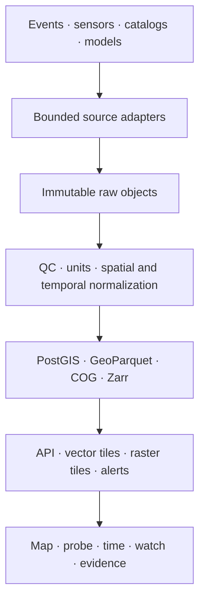

# Planetary Signals roadmap

Status snapshot: 2026-08-31

## North star

Planetary Signals should become a trustworthy, explorable nervous system for Earth and near-Earth space. It should let a person move from **what is happening now**, to **what changed**, to **what may be related**, while keeping source, time, uncertainty, licence and sensitivity visible.

The product must not compress earthquakes, air pollution, animal observations and social crises into one false “planet score.” Each domain keeps its own meaning and quality model.

## What exists now

- 51 source families in one searchable registry across eight domains.
- 16 no-key live event adapters, including NOAA buoy conditions, USGS river discharge, NASA DONKI solar flares and JPL close approaches.
- Three implemented adapters that become live when credentials are supplied: OpenAQ, eBird and the OpenTopography point probe.
- A point probe for weather, modeled air quality, marine conditions, place context and optional terrain.
- Per-source timeouts and honest `online`, `degraded`, `offline` and `unconfigured` states.
- Provenance links, freshness and confidence on every normalized signal.
- A labeled demonstration snapshot when all upstream services are unavailable.

ReliefWeb is already connected in this repository. NASA DONKI is also connected through the current public CCMC service and no longer needs a NASA API key for this adapter.

## The product we are building

The complete experience has seven connected surfaces:

1. **Live field** — a global map of vector events and observations.
2. **Planet probe** — the conditions at one coordinate, with model-versus-sensor labels.
3. **Time machine** — a scrubber and “what changed” stream across hours, seasons and decades.
4. **Environmental fields** — raster and gridded layers such as fire, pollution, rainfall, ocean temperature and elevation.
5. **Regional watch** — saved places, thresholds, digests and alerts.
6. **Relationship workspace** — transparent, testable comparisons between signals without claiming causation.
7. **Source and ethics atlas** — provenance, latency, licences, gaps, uncertainty and sensitive-data decisions.

## Delivery sequence

| Milestone | Outcome | Main work | Exit criteria |
| --- | --- | --- | --- |
| M0 — Truthful live mesh | Reliable current observations | Finish no-key adapters, credential states, source health and provenance | 15+ no-key adapters; one provider failure cannot break the page; sample data is always labeled |
| M1 — Credential activation | Air, birds and terrain go live | Obtain three keys, add deployment secrets, run smoke tests and review provider terms | OpenAQ and eBird show `online`; terrain appears in a point probe; no key reaches the browser or logs |
| M2 — Planetary time | Users can see change, not only a snapshot | Persist event history, add canonical observed/received times, replay API, time scrubber and change summaries | A region can replay at least 30 days; late-arriving records are handled; timezone semantics are tested |
| M3 — Environmental fields | Raster/model layers join point events | STAC discovery, COG tiles, Zarr/NetCDF processing, legends, units and model uncertainty | At least one land, atmosphere and ocean raster renders with acquisition time, scale, licence and no-data state |
| M4 — Durable nervous system | Request-time federation becomes production ingestion | Scheduler, queue, immutable raw store, normalizer workers, PostGIS/GeoParquet, dead-letter queue and lineage | Reprocessing is deterministic; raw payloads are recoverable; ingestion lag and failures are measurable |
| M5 — Regional watch | The system becomes personally useful | Watchlists, domain-specific thresholds, digests, notification preferences and quiet hours | A user can save a region and receive a traceable alert with source and threshold explanation |
| M6 — India depth | National and regional sources become first-class | OGD India, MOSDAC, IMD, Bhuvan, INCOIS, CPCB and CWC integrations | Each live source has documented rights, stable access, regional QA and an outage fallback; no portal scraping |
| M7 — Relationships, not hype | Cross-domain investigation becomes possible | Windowed joins, baselines, anomaly detection, lag exploration, notebooks and evidence cards | Every suggested relationship exposes inputs, time window, uncertainty and a “not causation” warning |
| M8 — Planetary memory | A portfolio-defining long view | Optional 3D globe, seasonal stories, research links, model overlays and reproducible exports | The interface can tell one end-to-end story from live event to history, evidence and export |

M1 can begin immediately. M2 should precede serious correlation work: relationships without durable time-series history will be visually impressive but scientifically weak. M3 and M4 can overlap, but only after one thin raster pipeline proves the storage and tiling choices.

## Technical target

Keep four data shapes separate:

| Shape | Examples | Serving path |
| --- | --- | --- |
| Event/observation | earthquake, alert, bird, buoy reading | JSON API and vector tiles |
| Point context | weather, AQ model, terrain elevation | coordinate probe with caching |
| Raster/field | smoke, rainfall, sea temperature, DEM | COG/Zarr preprocessing and raster tiles |
| Catalog/archive | STAC items, papers, long climate records | search/index first; fetch assets on demand |

## Cross-cutting work required

### Data contract

Add fields before persistence begins:

- `observedAt`, `receivedAt`, `validFrom` and `validTo` as distinct times;
- geometry plus spatial uncertainty or generalization reason;
- provider ID, upstream record ID and immutable raw-object reference;
- parameter, value, unit and conversion provenance;
- quality method, provider flags and review state;
- licence, attribution and redistribution restrictions;
- sensitivity class and public-coordinate policy;
- adapter version and normalization version.

### Operations

- Per-provider rate budgets, retry/backoff and circuit breakers.
- Structured logs with secrets redacted.
- Metrics for success rate, latency, record count, freshness lag and schema drift.
- Contract fixtures captured from provider responses and refreshed deliberately.
- Dead-letter storage for payloads that fail normalization.
- A status page that distinguishes provider outage, invalid credentials, rate limiting and schema change.

### Product integrity

- Never label modeled values as measurements.
- Never infer hazard severity from an absolute sensor value unless a domain-specific baseline or official threshold exists.
- Preserve provider warnings and provisional flags.
- Generalize or exclude sensitive wildlife locations.
- Show missing coverage instead of interpolating silently.
- Treat correlation as a research lead, not causal proof.

## Work packages for another agent

Each package should be a separate pull request with one accountable source owner.

1. **Credentials PR** — activate OpenAQ, eBird and OpenTopography using the steps in [integration-runbook.md](integration-runbook.md).
2. **Time model PR** — extend the observation contract, add migration/storage, fixtures and a replay endpoint.
3. **First raster PR** — use one public STAC collection, render a COG layer and expose acquisition/legend/no-data metadata.
4. **Ingestion skeleton PR** — add a scheduled worker, raw-object checksum, idempotency key, normalizer version and dead-letter path.
5. **Watchlist PR** — add saved geometry, threshold rules and an in-app digest before adding external notifications.
6. **India discovery PR** — verify official access and licences for all seven India providers; implement only sources with stable documented access.
7. **Evidence workspace PR** — add time-aligned comparison after M2 data exists, with explicit uncertainty and lag controls.

Every pull request must state: source terms reviewed, exact API/version, rate limit, cache plan, sample fixture date, quality mapping, sensitive-data decision, rollback method and acceptance-test evidence.

## Definition of done

The dream is fulfilled when a user can choose a place and time, see current events plus environmental fields, replay what changed, inspect every source and uncertainty, save a watch, and explore a possible cross-domain relationship without the interface overstating what the data proves. The service must remain useful when individual providers fail and reproducible when an upstream record changes.
